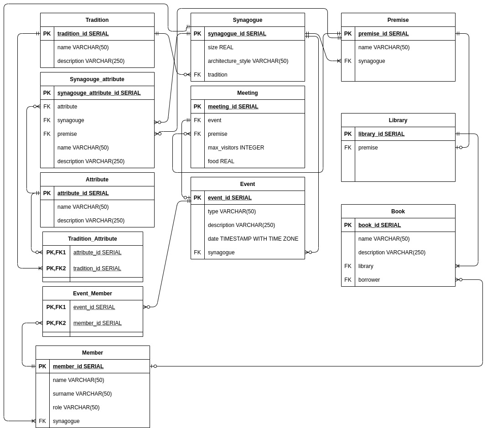

<h1 align="center">Welcome to Virtual Synagogue 👋</h1>

##  🛠 Technologies:

### ***Frontend:***
- React
- React-Router
- Typescript
- Mobx
- Axios
- Ant-design
- Chakra-UI
- Formik

### ***Backend:***
- Spring Boot
- Spring Security
- Hibernate
- Lombok
- Jsonwebtoken

### ***Database:***
- PostgreSQL
- Data logical diagram
- Triggers
- Functions
- Indices

##  ℹ️ Description of the subject area:
Source: https://sinagoga.jeps.ru/sinagoga/chto-takoe-sinagoga.html

An information system in the form of a virtual synagogue, in which community members can perform various religious rites, prayers (in other words: an event, its type, description, date and time are known), there is also a library that every community member has access to, it must contain a number of religious books: the Pentateuch, the Mishnah, the Talmud. The title and summary of the book is known.
It is customary in the synagogue to give lectures on Saturdays and holidays on the topics of the chapters of the Torah or on problems of Jewish law, such a conversation is conducted by the most knowledgeable member of the community or a visiting rabbi. Also, on Saturdays, groups gather to study the Torah. Such meetings are held in a certain section of the synagogue, and the maximum number of visitors is also indicated. The amount of food is calculated depending on the number of visitors. Members of the community have their own roles, such as: ordinary community member, rabbi, chazan, shamash, gabai. Each role has requirements for a community member and certain powers.
The synagogue can be of different sizes and be built in any architectural style. It consists of rooms (for example: vestibule, main room, balcony, ezrat our - room for women). The synagogue has temple attributes, of which the location (room), name, and purpose are known.
The synagogue is also determined by belonging to a certain tradition (community): Ashkenazi or Sephardic, Ashkenazi is divided in turn into two groups: Hasidic and non-Hasidic. For each tradition, characteristic temple attributes are indicated.

##  🔋 Business Processes:
- Everyone can register and log in except for Gabay (Admin), he is registered in the database in advance
-  Gabay (community leader) can schedule a community meeting
- The community member can reserve a place for the meeting
- The community member can schedule an event, specifying the invited people
- The community member can take a book from the library
- Community member(user) can return a book to the library

## 📈 Data logical diagram of db (model):

* Проект “Виртуальная синагога”
    * Первая итерация
        * Исправить REST API
            * Backend
                * Изменить типы и url запросов согласно принципам REST
                * Вынести DTO в отдельные сущности
            * Frontend
                * Согласовать axios запросы с исправленным backend
    * Вторая итерация
        * Backend
            * Исправить процесс отлавливания и обработки ошибок Spring REST MVC
            * Убрать try/catch блоки из контроллеров и сервисов
            * Добавить ResponseEntityExceptionHandler для обработки ошибок и формирования ответа
        * Frontend
            * Изменить клиентскую обработку респонсов с ошибками
            * Добавить парсинг передаваемых с бэкенда сообщений ошибок в сообщения для вывода пользователю
    * Третья итерация
        * Cleanup кода
        * Унификация методов сервисов (например, грамотное выкидывание DataNotFound для всех сущностей)
        * Рефакторинг репозиториев (удаление излишних методов, модификация JPQL запросов)
        * Декомпозиция классов и методов (например, вынесение сущностей DTO из контроллеров, вынос однотипного кода и
          прочее)
        * Добавление необходимых транзакций

<h3>Выполнение:</h3>

* Ссылка на отчёт со всеми
  итерациями: [док](https://docs.google.com/document/d/1H1Ckhq3smYMT3suzJZdiZCK506NQSWS3hTVGZbzkCUM/edit#heading=h.p2wjcjmstir6).
* Ссылка на видео: [видео](https://drive.google.com/drive/folders/1rNF57aA9vkhd_tTotyfgaqpkSX4e_qQc?hl=ru).
